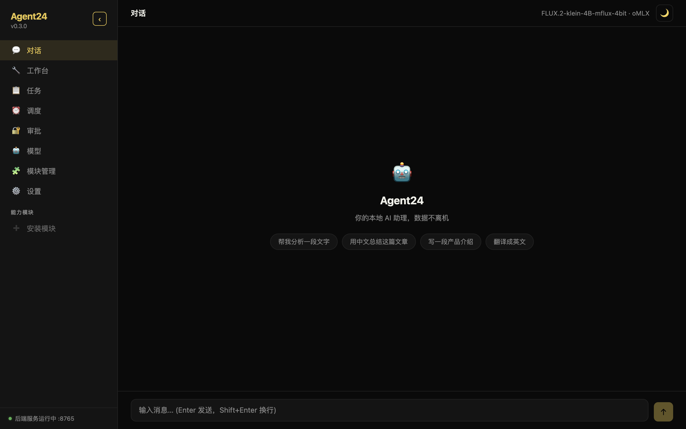
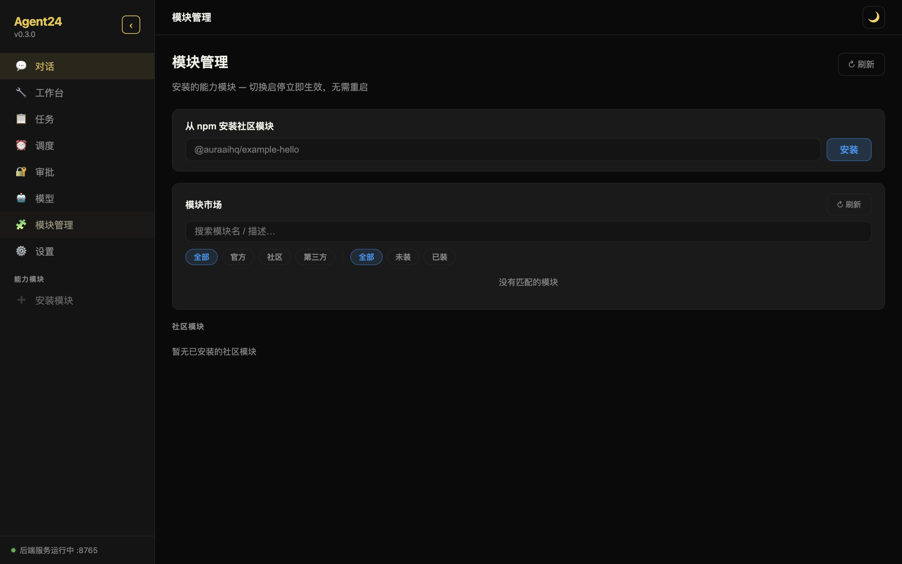
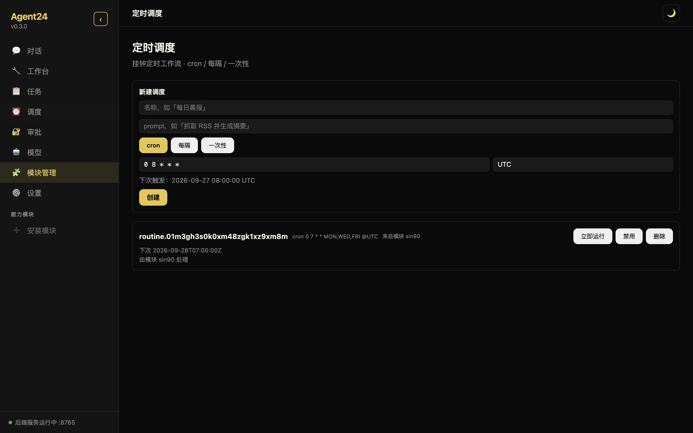
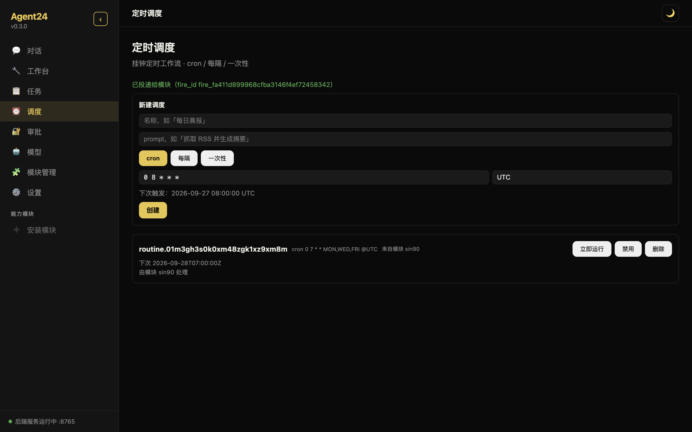

# Agent24 + Sin90 现场演示记录（2026-09-27）

> 代码基线：Agent24 `main@f504ae0`（ME4 调度回调 + 推理回调 + SDK 原型 #514/#515/#516 已合并），Sin90 `main@8393ad5`（M3–M5 + T5.7.2 已合并）。
> 模型：本机 oMLX（`127.0.0.1:8088`，`Qwen3-8B-4bit`）。
> 隔离：两个演示 daemon 都用独立 HOME（`/tmp/a24demo-cli`、`/tmp/a24demo-desktop`），没有碰用户真实数据 `~/.agent24`。

## 1. 演示了什么

| 步骤 | 结果 |
|---|---|
| `agent24 os install` 安装 Sin90 包（`domain-os.yml` + `bin/sin90`） | 装进隔离 HOME 的 packages 目录 |
| `agent24 daemon start` | daemon 启动，Sin90 自动挂载，2 秒内经内核代理响应 `/today` |
| `agent24 os list` | `sin90 0.5.0 [mounted] grants: events,models,scheduler,memory,approval` |
| 经内核代理调 Sin90 REST：建 Direction「演示：健康与专注」、3 个任务、Routine「每周3次运动」（cron `0 7 * * MON,WED,FRI`） | 全部成功 |
| `GET /api/v1/schedules` | 内核里出现 `routine.<id>` 调度行，归属模块 sin90（Sin90 经 `_a24/scheduler/*` 回调注册） |
| `POST /api/v1/schedules/<id>/run_now` | 202，Sin90 事件里出现 `kind: fired, trigger: run_now`（内核 → 模块 fired 投递） |
| `POST /api/v1/sin90/ai/classify` | 经 `_a24/model/complete` 走本机 oMLX（每条约 4–6 s），生成 2 条待确认的 `assign_task_direction` 提案 |
| `GET /api/v1/usage?module=sin90` | `calls_ok: 2, total_tokens: 307`，全部 `served = local` |
| 桌面端（Electron，自带 sidecar daemon，同样挂载 Sin90） | 调度页能看到来自 sin90 的 routine；点「立即运行」显示「已投递给模块（fire_id …）」 |

完整 CLI 输出见 [`run-demo.log`](run-demo.log)；复现脚本 [`run-demo.sh`](run-demo.sh) / [`stop-demo.sh`](stop-demo.sh)（脚本里的 `<scratchpad>` 是本次会话的临时目录，复现时改成你自己的目录；HOME 必须用短路径，见问题 D4）。

## 2. 截图

**对话首页**（右上角默认模型见问题 D1）

**模块管理页**（管的是 npm 社区模块，看不到 Sin90，见问题 D2）

**调度页**：Sin90 注册的 routine 出现在内核调度列表里，标「来自模块 sin90」

**点「立即运行」之后**：绿色提示「已投递给模块」

## 3. 发现的问题（先记录，回头集中修）

已登记进 [`docs/agent/followups.md`](../../agent/followups.md) FU-89 ~ FU-93。

| # | 问题 | 影响 | FU |
|---|---|---|---|
| D1 | 桌面端对话页右上角默认模型显示 `FLUX.2-klein-4B-mflux-4bit`——这是**生图模型**，不该作为对话默认模型 | 用户直接发消息可能打到生图模型上失败 | FU-89 |
| D2 | 「模块管理」页只管 npm 社区模块；内核挂载的 domain-OS 模块（如 Sin90）在桌面端没有任何列表/状态展示，只能从调度页间接看出 | 用户看不到 Sin90 是否挂载、授予了哪些能力、是否健康 | FU-90 |
| D3 | 桌面端 dev 模式把渲染页写死为 `http://localhost:5173`，该端口被本机其他项目占用时窗口会加载别的站点；演示改用 `pnpm run build` 后的生产包绕开 | 开发体验；可能误导为「界面坏了」 | FU-91 |
| D4 | HOME 路径较长时 daemon 起不来：回调 socket 路径超过 macOS 103 字节上限（SPEC-ME3 已警告），报错只说路径太长，不提示怎么办 | 自定义数据目录的用户可能无法启动 | FU-92 |
| D5 | 桌面端侧栏底部显示「后端服务运行中 :8765」，而本次 sidecar 实际端口是 60128；待核实是显示了配置端口还是实际端口 | 可能误导排障 | FU-93 |

另两条环境问题（不是产品缺陷，记在这里备查）：`electron@34.5.8` 的原生二进制在 `pnpm install` 时被跳过、需手动跑其 `install.js`；本机没有给终端授予辅助功能权限，截图/点击改用 Chrome DevTools Protocol。

## 4. 下一步

演示确认后进入 A3：AgentEar 以附着式模块接入 Agent24（设计见 `docs/design/A3-ATTACHED-MODULE.md`，起草中），交付门槛为真机单轮「说一句 → Agent24 收到转写 → 本地模型回复 → AgentEar 播报」，零远端流量。
