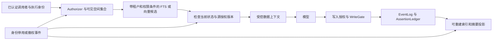

# R4：企业级助手的记忆与知识调研

调研日期：2026-10-02。基线：[M1-PLAN-v2.md](../../agent/M1-PLAN-v2.md)。本文区分**官方已说明的机制**、**未核实的产品保证**和**给 Agent24 的设计建议**；“未核实”不表示产品没有该能力。官方安全声明也不等于本次独立验证。

## ① 一句话结论

**Agent24 应共享“作用域、授权、来源和生命周期”这一套记忆内核，让个人偏好与企业知识分别受控；M1 最值得补强的是召回时的授权与失效检查、记忆作为数据的注入方式和撤回语义，而企业化之前必须解除“原文永久不可擦除”这一产品级约束。**这是对下述官方机制的架构归纳，而非某家厂商的原话。

## ② 逐项调研

### 1. Microsoft 365 Copilot：Graph 知识与 Copilot memory 是两个数据面

- **是什么／核心模型**：Microsoft Graph 提供用户可访问的邮件、文件等工作数据；Semantic Index 增强语义 grounding，Copilot 在模型调用前后使用 Graph 上下文。索引包含 tenant/user 层次；Synced Copilot connectors 可把外部内容接入 Graph。它不是把企业文件统一变成个人记忆。[架构][ms-arch]、[Semantic Index][ms-index]
- **写入／召回／更新**：企业知识随源和索引更新；grounding 只使用当前用户被授权访问的内容，索引不扩大源权限。站点是否允许搜索也影响可检索性。“查询时按权限裁剪”不应解读成所有连接器每次都实时请求源系统 ACL；通用端到端撤权时延未核实。[Semantic Index][ms-index]
- **个人记忆／遗忘**：当前文档将 Copilot personalization/memory 标为 preview，包含 saved memories、从 chat history 推断的信息和 custom instructions，存用户 Exchange mailbox 的隐藏文件夹。删除聊天**不删除 saved memories**；关闭功能是停止使用而非删除；saved memories 保留到用户主动删除。[memory 管理][ms-memory]
- **管理员与治理的关键例外**：管理员可禁用 personalization，可通过 eDiscovery/Graph Explorer 搜索、导出、删除 saved/inferred memories；custom instructions 尚不能通过这些 discovery 工具发现。**Purview retention policies/labels 不适用于 Copilot memory；memory/personalization 操作不产生 Purview audit entries；管理员不能限制写入 memory 的信息类别。**不能用“存在 mailbox”推导它具备完整 mailbox 治理。[memory 管理][ms-memory]
- **聊天保留／离职／部署**：Copilot interactions 有独立 Purview 保留与 eDiscovery 路径；用户删除不必然清除保留或 hold 副本，受保留的离职用户消息可进入 inactive mailbox。该保证不能外推到 saved memory 的 legal hold，后者未核实。M365 是云服务；Semantic Index 的存储与处理地域有各自条件，应按租户、Multi-Geo、EU Data Boundary 核对，不能只看文件所在地区。[聊天保留][ms-retention]、[索引驻留][ms-index]
- **评测／优缺点／M1 关系**：本次未核实可复现的 memory 准确率、ACL 泄漏率及撤权 SLO。架构优势是复用既有身份和内容权限；代价是原有过宽分享不会被 AI 自动修复，memory 与 chat 的治理存在覆盖差异。**建议 M1-T03/T04 与 T06/T09 分开标注原文、摘要、断言生命周期，T10/T11 明示撤回对象。**依据：[权限机制][ms-index]、[memory 例外][ms-memory]、[M1 基线](../../agent/M1-PLAN-v2.md)。

### 2. Glean：文档 ACL + identity graph + 查询时权限裁剪

- **是什么／核心模型**：连接器汇集跨应用内容；Indexing SDK 的安全模型由逐文档 ACL、用户、组与成员关系组成。官方架构博客描述 knowledge graph 关联项目、客户、内容与人员，personal graph 将个人跨工具活动按时间和任务组织，用于个性化，称个人活动数据仅本人可见；这是厂商架构说明，合规后台例外未核实。它不同于用户自述偏好账本。[权限 SDK][glean-acl]、[知识图与个人图][glean-graph]。Confluence connector 也明确摄取活动信号。[connector][glean-confluence]
- **写入／召回**：连接器在索引时写权限与 identity graph，Glean 在 query time 执行权限过滤；未知组的 ACL 匹配不到用户。SDK 明确反对先用 allow-all 索引敏感内容、以后再补 ACL；组成员关系也不宜永久展开成用户列表。[权限 SDK][glean-acl]
- **更新／遗忘／离职**：删除及权限更新依连接器的 webhook、增量／全量 crawl 传播；无删除通知的源需等待后续全量 crawl。移除 connector instance 与后台数据清理也有不同阶段。因此“query-time permission-aware”不代表查询使用的身份副本永远新鲜。统一离职撤权 SLO、既有答案副本级联失效未核实。[Crawling FAQ][glean-crawl]
- **管理员／驻留／部署**：官方 deployment guide 描述 SaaS 和 customer-hosted Cloud-Prem；后者仍由 Glean 运维，并非传统自行安装。另有官方发布介绍 customer-managed deployment、私有连接和客户控制密钥；两种描述不能合并成“所有客户均可完整自运维”，采购范围需另核实。[部署文档][glean-deploy]、[customer-managed 公告][glean-managed]。个人画像的合规导出例外、legal hold 和记忆保留规则未核实；安全门户说明有管理员审计及导出能力。[安全架构入口][glean-security]
- **评测／优缺点／M1 关系**：SDK 要求 negative-identity 测试及真实受限用户验证，但不是效果 benchmark。优势是把内容权限与身份同步明确分开；主要工程成本是连接器授权语义、同步新鲜度和运维。**建议 T07/T07a/T08 除相关性外增加 owner 隔离反例；企业版单独度量 ACL 同步滞后。**依据：[SDK 验证与模型][glean-acl]、[M1 基线](../../agent/M1-PLAN-v2.md)。

### 3. Salesforce Agentforce / Data Cloud（当前文档亦称 Data 360）：业务身份与 retriever 的组合

- **是什么／核心模型**：Data Library 接入文件等内容，Data 360 将其处理成数据模型对象、chunks、search index；retriever 选择 data space、对象、索引、过滤条件和返回字段，在 agent 运行时 grounding。data space 是组织数据分区，不能仅凭名称把它当成终端用户身份验证。[官方配置教程][sf-data]
- **写入／更新／遗忘**：官方 search-index 文档说明源 DMO/UDMO 变更触发增量索引，源记录删除会删除派生 transcripts、chunks、vector embeddings；刷新仍取决于 data stream 模式和调度。该承诺限于索引派生物，不能推导已写入其他 Case/Knowledge 记录的回答会随源撤回。此帮助页 curl 仅返回页面壳，正文通过官方页面浏览核对，证据可重复性弱于可直接抓取的开发者文档。[索引生命周期][sf-index]
- **召回／ACL**：官方教程展示对 agent 所用用户授予对象字段 Read Access；Service Agent 文档说明安全检索尊重执行用户权限。必须先核对 agent type、运行身份和 action/Flow 的执行上下文，不能把“访客正在聊天”直接等同于“访客自身 Salesforce ACL”。外部源 ACL 到每个 Data Library chunk 的完整映射、撤权时延未核实。[权限配置教程][sf-permissions]、[Service Agent 限制][sf-service]
- **审计／个人边界／部署**：Agent Platform Tracing 可把 spans 写入 Data 360；Session Tracing 记录用户输入、路由和响应，查询 trace 需相应 Data Cloud/DMO 权限。因此 LLM 供应商零保留不等于组织内无对话记录。这里核实的是 Salesforce 平台集成部署，离线本地部署未核实；个人偏好存储及员工离职归属、各类 trace 的 retention/legal hold/地域条件均未核实。[Tracing 架构][sf-tracing]
- **评测／优缺点／M1 关系**：未核实本范围内可复现的记忆效果或 ACL 安全测评。优势是源数据、检索配置与业务执行相连；风险是“有权运行 agent”“agent 有权访问数据”“用户有权看到结果”并非同一判定。**建议 T01 保留 Actor 与执行者的区别，T06 evidence 不丢失，后续派生索引按来源删除。**依据：[权限教程][sf-permissions]、[派生删除][sf-index]、[M1 基线](../../agent/M1-PLAN-v2.md)。

### 4. Slack AI：临时答案、Recap、发布摘要有不同生命周期

- **是什么／核心机制**：以用户可访问的 Slack 对话和文件生成搜索答案、摘要和 recaps；官方保证 AI search 不比用户本身的 Slack 搜索获得更多内容，并提供源引用。它首先是协作内容的 RAG，不宜默认当作独立个人长期偏好服务。[AI 安全][slack-ai]
- **写入／召回／更新／遗忘**：搜索答案与手动对话摘要是 ephemeral responses；Recap 存储 90 天，引用的消息被删除或 tombstone 后 recap 也删除。工作流生成的频道摘要若发为 message 或写入 canvas，则按这些新对象的 workspace retention 保留。**文档没有承诺已发布副本随源 ACL 撤销而同步撤销。**[AI 生命周期][slack-ai]
- **管理员／审计／法律保全**：Owner/Admin 可控制 AI 功能，Enterprise 可按用户／组限用。Enterprise legal hold 可保留指定成员消息与文件的编辑／删除内容，适用范围和例外需按该文档操作；这不等于所有 AI 临时响应都有保全副本。[AI 管理][slack-ai]、[legal hold][slack-hold]。审计与 Discovery API 是独立管理路径，不能用普通用户 UI 可见性代替合规可见性。[audit logs][slack-audit]、[Discovery API][slack-discovery]
- **部署／未知项**：官方描述 AI 在 Slack 控制的基础设施内处理；本次未核实所有 AI 功能的具体推理驻留地区、撤权传播上界、个人偏好后台及离职归属，也未核实可本地自部署的等价 Slack AI。[AI 安全][slack-ai]
- **评测／优缺点／M1 关系**：官方描述质量监控，未核实公开可复现的该产品记忆基准。优点是明确区分派生物；代价是把摘要发布成新对象后，需要独立治理。**建议 T03/T04 将 session.summary 视为派生数据；T09/T11 不把撤回 assertion 宣称成清除原聊天或其中的摘要。**依据：[AI 生命周期][slack-ai]、[M1 基线](../../agent/M1-PLAN-v2.md)。

### 5. Google Agentspace / Gemini Enterprise：内容同步、身份同步与 IAM 分层

- **是什么／核心模型**：Agentspace 已并入 Gemini Enterprise；这里是 Google Cloud 的企业搜索与 agent 产品线，与下节 Gemini in Workspace 分开。连接器构建 data stores，支持摄取索引及部分源的 federation。[服务名称说明][google-name]、[连接器模型][google-connectors]
- **写入／更新／遗忘**：官方区分 full sync、incremental sync 和 identity sync。full sync 包含源对象新增、更新、删除；文档中的 incremental sync 不同步 identity data，也不处理 entity 删除。不能把“内容持续增量同步”写成“权限与删除实时同步”；具体 connector 支持模式还需单独核实。[同步语义][google-connectors]
- **召回／权限**：Cloud IAM 控制 app/data store 的资源访问，document-level access control 依源 ACL、用户身份和组映射；自定义源可结合 identity provider / Workforce Identity Federation。资源 IAM、文档 ACL、授权数据同步是三层，不是一个索引过滤开关。[文档级 ACL][google-acl]、[细粒度 IAM][google-iam]
- **管理员／保留／驻留／部署**：usage audit logs 可包含 query、用户、grounded answer/reference，官方提示日志不会自动滤除敏感数据。安全文档声明按用户请求删除的数据在 60 天内删除；不能据此推断每种 backup、第三方副本或 legal hold 情形的精确行为。地域可选项及数据驻留／机器学习处理承诺按区域和功能而异；这是 Cloud 服务配置，不是离线本地方案。[日志][google-audit]、[安全与删除][google-security]、[locations][google-locations]
- **个人边界／评测／M1 关系**：本次未核实该产品个人偏好对管理员的精确可见性、离职后偏好归属，以及公开可复现的泄漏率／撤权 SLO。优点是明确拆开控制平面；代价是同步与区域配置复杂。**建议未来连接器至少有 content_revision、acl_revision、identity_revision；M1-T02 先保持 org/user 复合归属，不能只用裸 user 标识资源。**依据：[同步][google-connectors]、[M1-T02/T05](../../agent/M1-PLAN-v2.md)。

### 6. Gemini for Google Workspace：工作账号与消费者 memory 不能混用结论

- **是什么／召回模型**：Gemini in Workspace 使用用户本身的 Workspace 数据访问权限；管理员可管理其数据访问能力，Drive 分享和部分内容使用限制也影响 Gemini。[Workspace 权限][workspace-access]
- **写入／更新／遗忘**：Workspace personalization instructions 可跨支持的 Workspace 产品使用，当前文档有 Beta、账号／地区可用性条件；它与 Gemini Apps instructions 独立、不互相同步。用户能新增、修改、删除或关闭使用；关闭不删除已保存 instructions。[Workspace instructions][workspace-instructions]。消费者 Gemini 的 past-chat memory 文档明确排除 work/school account，不能把消费者功能套用到企业账号。[Gemini past-chat 条件][gemini-memory]
- **管理员／保留／个人边界**：管理员对工作账号 Gemini app 的 conversation history 可设 3/18/36 个月或关闭；关闭后仍可能短暂保留，文档上限为 72 小时。这是 Gemini app 工作账号规则，**不是所有 Workspace 侧边栏及 Gemini Enterprise 的统一规则**。instructions 的管理员读取能力、离职转移、各交互类型 Vault/legal hold 覆盖未核实。[Gemini app 历史管理][workspace-history]
- **评测／优缺点／M1 关系**：本次未核实可复现的个人记忆效果及撤权 SLA；已核实优势是用户级偏好控制，限制是多产品的历史／instructions／组织内容各有边界。**建议 T11 在用户界面分别呈现“偏好断言”“会话记录”及未来“组织知识”；关掉记忆使用不应冒充删除数据。**依据：[instructions 生命周期][workspace-instructions]、[M1 基线](../../agent/M1-PLAN-v2.md)。

### 7. ServiceNow Now Assist / AI Search：early binding 与 late binding 的明确范例

- **是什么／核心模型**：Now Assist 可通过 AI Search profiles 对知识等来源进行 RAG；AI Search 索引平台记录及外部内容，保留角色 ACL、domain separation 和指定表的 user criteria。[Now Assist 工具][sn-tools]、[内容安全][sn-security]
- **写入／召回／授权**：索引时保留可支持的安全元数据；query time 默认把用户安全条件放入查询（early binding）。涉及 scripted table ACL 等情况时转为 late binding，对候选进一步调用 `GlideRecord.canRead()`；管理员可强制 late binding。官方同时明确不支持 scripted/conditional field-level ACL，不能笼统写成“继承全部 ACL”。外部内容需将源用户／组映射到平台用户。[内容安全][sn-security]
- **更新／遗忘／边界**：本次未核实各 connector 删除、权限变更、身份停用到结果失效的统一上界，也未核实已发布生成摘要会随源撤权重算。Agent/workflow 运行身份和 role masking 是另一层访问控制，不能代替搜索过滤。[agent 权限控制][sn-agent]
- **管理／部署／评测**：已核实范围是 ServiceNow 实例的 AI Search/Now Assist 配置、权限和 access tests；记忆专属 retention、legal hold、员工偏好、推理驻留及完全本地部署的能力未核实。未核实公开可复现的记忆质量评测；权限测试不是相关性 benchmark。[Now Assist 工具][sn-tools]、[agent 权限控制][sn-agent]
- **优缺点／M1 关系（判断）**：好处是用 early binding 降低候选成本，late binding 处理动态规则；代价是权限过滤影响结果数、分页和延迟。**T07a 的 owner 条件应与 FTS 候选选择结合，T07 注入前再核实有效状态；企业版不应先取全局 top-k 再删除无权限项便结束。**依据：[查询过滤及计数限制][sn-security]、[M1 基线](../../agent/M1-PLAN-v2.md)。

### 8. Atlassian Rovo：个人 memory 明确对组织管理员不可见

- **是什么／模型／摄取**：Rovo 组合 Search、Chat、Agents 与 Teamwork Graph。连接器区分 synced（同步索引）、direct（通过源搜索 API 实时获取，Atlassian 不存储／索引该内容）及 Smart Link；不能把不同 connector 类型视为同一种复制数据模型。[connectors][rovo-connectors]
- **召回／更新／遗忘**：Rovo 继承 Atlassian 与连接应用权限，并更新权限变化；具体同步撤权、索引清除和离职身份停用的端到端 SLA 未核实。第三方 LLM 不留存数据的声明，与 Rovo 本身为安全目的保留 prompt/output 的规则不同。[隐私与权限][rovo-privacy]
- **个人记忆**：用户＋site scoped；一类是 Teamwork Graph 活动摘要，可建议修改；另一类是显式聊天事实，可查看、修改、删除。官方明确其他用户**包括 organization admins 不能查看这些 memory facts**。关闭 memory 不再保存新的 explicit memories，也不使用已有 memories 个性化。它不意味着所有 agent conversation 都对管理者不可见：agent owner/manager 有另一套会话审阅能力。[memory][rovo-memory]、[agent conversation review][rovo-review]
- **治理／部署**：Rovo 云数据有 residency 配置，覆盖哪些 logs、agent 配置和接入内容需按 in-scope 清单检查；原 Atlassian app 数据的地域规则不能凭 Rovo 设置覆盖。memory 的 legal hold、离职后归属与删除全链路未核实。[data residency][rovo-residency]
- **评测／优缺点／M1 关系**：未核实可复现的记忆或撤权测试结果。优点是个人 memory 有明确隐私边界；限制是活动摘要与显式事实控制不同。**建议 T02/T06 把归属与可见性分开定义；未来企业 personal 的“管理员能否看”必须显式选策略，不能照抄某一种厂商默认。**依据：[memory][rovo-memory]、[M1 基线](../../agent/M1-PLAN-v2.md)。

### 9. Notion AI 企业版：Enterprise Search 与 Custom Agents 的授权不同

- **是什么／模型／召回**：Enterprise Search 对 Notion 与连接应用内容建 embedding/vector index，查询时检查两侧权限，并维护用户映射。**Custom Agents 是例外：有独立权限，能让使用者通过 agent 接触自己原本不能直接访问的信息**；这是产品允许的委托共享，不能误称所有 Notion AI 都严格取调用人权限交集。[Search 安全][notion-search]、[Custom Agent 安全][notion-agent]
- **写入／更新／遗忘**：Search 文档称源权限变化通常一小时内反映，大 workspace 更久；删除内容变得不可搜可能需 30–60 分钟。同页删除表又写“Immediately unsearchable”，因此本报告**不将它解释为严格即时撤销保证**，应以具体 connector 实测和合同为准。断开连接器文档给出 24 小时删除、源/workspace 删除后 embeddings 最长 60 天清除，展示了检索屏蔽与物理清理的差异。[Search 生命周期][notion-search]
- **管理员／个人边界**：Custom Agent 管理有 Agent Directory、content search、audit、ownership transfer；Enterprise Admin APIs 包含 legal hold、workspace export、注销 managed users。不能从 Enterprise LLM provider 的 zero data retention 推导管理员看不到 workspace 里的内容。独立个人偏好 memory 的管理员可见性与离职归属未核实。[Agent 管理][notion-agent]、[Admin APIs][notion-admin]、[AI 数据处理][notion-ai]
- **审计／驻留／部署／评测**：Enterprise audit log 可导出、对接 SIEM，具体保留按文档与套餐；本次未核实 AI connector 数据与全部推理的统一驻留保证、离线自部署，以及公开可复现的记忆准确率／撤权测试。[audit log][notion-audit]、[Search 安全][notion-search]
- **优缺点／M1 关系（判断）**：优点是公开了权限同步与数据清理窗口；风险在于将 Search 的权限承诺错误套用到共享 Custom Agents。**T01 的未来 AccessRequest 必须同时含调用者、agent principal 和 delegation，T07/T10 默认采取无委托则不能越权。**依据：[Custom Agent 安全][notion-agent]、[M1 基线](../../agent/M1-PLAN-v2.md)。

### 10. Dust：空间知识与 user × agent memory 分开

- **是什么／核心模型**：企业 agent 平台；管理员通过 Connections 选择源渠道、文件夹、页面，摄取后再通过 Company Data 或特定 Space 向用户开放。这一文档描述的是**管理员摄取＋Dust 空间授权**，不足以证明每个源都逐查询实时继承调用者 ACL。[Connections][dust-connections]
- **写入／召回／更新**：连接数据自动同步，文档说更新通常数分钟。新建的 Notion MCP tools 使用官方 MCP server，以用户身份执行；旧 tools 可继续旧实现。该变更不影响 Notion Connector，说明同步知识与在线工具是两条授权路径。[Connections][dust-connections]、[Notion MCP 变更][dust-mcp]
- **个人记忆／遗忘**：Agent Memory 可加到 custom agent，saved memory 按 user＋agent 分隔，用户可以检查及删除。共享 agent 并不自动共享各用户的 memories。管理员是否有合规读取例外、离职转移、源 ACL 变化如何处理已抽取个人事实，本次未核实。[Agent Memory][dust-memory]
- **管理员／治理／部署**：Enterprise audit logs 面向管理员，记录 actor、action、resource 等并可 CSV 导出；官方安全页列区域及企业部署控制。精确 legal hold、备份清除及全功能离线部署未核实。[audit][dust-audit]、[security][dust-security]
- **评测／优缺点／M1 关系**：未核实可复现的产品级记忆／ACL benchmark。优势是记忆作用域清楚；风险是管理员选入源数据后按另一套空间权限开放，需主动审查分享范围。**M1 保持单 personal，不立即改成 user×agent；把 agent_id 预留为可选用途限定，避免未来所有 agent 无差别使用一份画像。**依据：[memory][dust-memory]、[Connections][dust-connections]、[M1 基线](../../agent/M1-PLAN-v2.md)。

### 11. Langdock：个人 Chat memory 与 Knowledge Base、Agent、Project 各有范围

- **是什么／模型**：企业多模型聊天／agent 平台；Knowledge Bases 是可供 chat、Agents、Workflows 使用的文档集合，召回相关 sections，而非整库塞入上下文。管理员可按 workspace、user、group 配权限，也能分别控制 integration 与 action 使用权。[Knowledge Bases][langdock-kb]、[权限][langdock-permissions]、[action access][langdock-actions]
- **写入／更新／遗忘**：Chat Memory 支持自然语言保存、更新、删除 facts/preferences，也有账户 Memory 页。需要 workspace 和个人设置开启；文档明确 **Project、Agent chats 不使用这个 Memory 功能**。因此“账号个人记忆”不是自动向一切执行场景注入。[Memory][langdock-memory]
- **ACL／个人边界**：安全页声明 connector 权限镜像源权限，但索引／查询过滤的具体执行位置、ACL 同步与离职撤权 SLO 未核实；memory 对 workspace admin 的内容可见性也未核实。[安全声明][langdock-security]
- **管理员／部署／驻留**：官方列 EU multi-tenant、single-tenant、BYOC/on-prem 与自定义 retention。条款说明部分 global deployment 模型可在 EU 外推理，因此“EU-hosted”不能概括所有可选模型路径；legal hold、备份删除期限和审计导出细节未核实。[security][langdock-security]、[provider/region 条款][langdock-terms]
- **评测／优缺点／M1 关系**：未核实公开可复现 benchmark。优点是个人 memory 的适用场景明确且有部署选择；限制是必须逐模型核对地域、逐 integration 核对权限。**建议 T06b/T07b 的 oMLX 任务携带获授权的数据切片；本地抽取／embedding 并不表示主聊天模型也在本地。**依据：[功能范围][langdock-memory]、[地域条款][langdock-terms]、[M1 基线](../../agent/M1-PLAN-v2.md)。

### 12. Letta：agent 持久记忆、conversation 与组织权限不是同一作用域

- **是什么／数据模型**：当前文档的持久主体是 agent，conversation 是其消息线程，SDK session 是活动连接；同 agent 的不同 conversations 共用长期记忆。当前长期记忆采用 MemFS；旧 API 的 memory blocks 仍有文档，blocks 可共享、可设 read-only，不能混用新旧架构解释权限。[会话模型][letta-session]、[conversation memory][letta-conversations]、[legacy blocks][letta-blocks]
- **写入／召回／更新／遗忘**：agent 读写 MemFS；Cloud shared-memory repositories 由 organization 拥有，agent 通过 attach 及 Git pull/push 共享。detach 停止使用不等于历史 Git blobs 物理擦除；后者本次未核实。会话摘要压缩上下文，原消息历史仍可搜索。[shared memory][letta-shared]、[conversations][letta-conversations]
- **org／user／agent／session 与管理员**：Cloud agent 默认对创建者私有，可共享给 organization；conversation 默认对创建者私有，**organization Admin 可访问组织全部 agents/conversations**。因此 UI private 不能解释成管理员不可见；多个用户使用同一共享 agent 时的敏感记忆传播，还应与“conversation 私有但 agent memory 共享”联合验证。[组织权限][letta-permissions]、[conversation memory][letta-conversations]
- **部署／行级隔离**：当前支持 local runtime 与自托管 App Server；本地保存状态与使用远程模型是可分开的选择。旧 `letta-ai/letta` Python ORM 路径本次 curl 返回 404，不能凭历史源码断言当前实现具有某种 `organization_id` SQL filter 或 PostgreSQL RLS；**数据库行级安全实现未核实**。[当前自托管文档][letta-selfhost]、[已尝试的旧源码路径][letta-old-source]
- **评测／优缺点／M1 关系**：本次未核实其多租户隔离／撤权公开基准、组织 memory legal hold 或删除证明。优势是 agent/线程/共享知识解耦；风险是共享持久 agent 可能成为跨 conversation 信息通路。**M1-T03 owner＋session 约束应保留，T02 不把 agent 身份当作人的个人空间，未来共享 agent 必须显式选择共享或用户私有记忆。**依据：[session][letta-session]、[权限][letta-permissions]、[M1 基线](../../agent/M1-PLAN-v2.md)。

### 13. Mem0：entity scoping 不等于终端用户授权

- **是什么／数据模型**：提供消息到 memories 的提取、存储、检索层；当前文档区分 SQL facts/metadata、vector embeddings 和 entity store。用户／agent／run 是检索作用域，应用决定将结果如何放入 prompt；OSS 与托管 Platform 不是相同功能集。[机制][mem0-how]
- **org／user／agent／session**：Platform 有 organizations/projects、成员权限及 project-specific API key；entity 字段包含 `user_id/agent_id/run_id`，Platform 还有 `app_id` 示例。它们不是必须依次嵌套的租户树。当前 OSS 源码将 entity scope 写入 metadata，并传递到查询 filters；它不是认证当前终端用户的登录层。[Platform org/project][mem0-org]、[作用域示例][mem0-scopes]、[固定提交源码][mem0-source]
- **写入／更新／召回／遗忘**：当前 how-it-works 文档描述 additive extraction、去重及多信号召回，改错用显式 update/delete；不要直接把早期论文中的自动 consolidation 描述当成当前 SDK 合约。删除 API 有按 ID 和 scope 的路径；到期不再召回与真正删除也不是一回事。[机制][mem0-how]、[delete][mem0-delete]、[源码][mem0-source]
- **隔离／管理员／部署**：OSS 可由部署者运行后端存储；Platform 提供 org/project 管理，但没有证据证明 OSS 的 metadata filters 自动变成 DB 原生 RLS。尤其单 ID 读／改／删必须由应用鉴权，不可只保护 search。legal hold、完整备份擦除、个人记忆管理员隐私承诺本次未核实。[org/project][mem0-org]、[OSS 代码][mem0-source]
- **评测结果**：2025 年作者论文在 LOCOMO 上报告相对其 OpenAI baseline 的 LLM-as-a-Judge 指标提升 26%，相对 full-context 的 p95 latency 降低 91%、token cost 减少超过 90%；这是**作者自报、特定模型与数据集配置**，不是当前版本实测，更没有证明 tenant 隔离、GDPR 删除或中文 M1 recall。[论文摘要][mem0-paper]
- **优缺点／M1 关系（判断）**：接口简单，适合做可替换的本地抽取／召回实验；安全边界仍须应用负责。**T06b/T07b 可借鉴带 scope 的接口，不能允许模型自行选择 owner；M1 的 EventLog＋evidence 应继续作为事实可追溯依据。**依据：[作用域][mem0-scopes]、[M1 基线](../../agent/M1-PLAN-v2.md)。

### 14. Zep 与开源 Graphiti：项目隔离、用户图与派生来源授权

- **是什么／数据模型**：Graphiti 是开源 temporal knowledge graph framework；Zep 是在其基础上提供用户、threads、Context Graphs 和治理的托管服务，不能把 Zep Enterprise ABAC 当作 Graphiti 开箱即有。user graph 汇总同一用户不同 threads 的上下文；共享领域知识使用独立 graph。[产品边界][zep-compare]、[用户图][zep-users]
- **写入／更新／召回／遗忘**：episodes 派生实体、边、摘要，并记录来源关联；时间事实可失效而保留历史。Zep 删除 user 会删除其 threads、artifacts 和 user graph；删除单 episode 按来源关联处理，不应假定删一条原文就删除所有重复来源共同支持的实体。[Graphiti 机制][graphiti-readme]、[用户删除][zep-users]、[provenance][zep-projection]
- **授权分层**：Zep account/project 外，Enterprise ABAC 对 API keys/UserGroups 逐请求判 action，再限制返回数据。源 episode metadata 投影到派生节点、边、摘要；默认 exact-set matching 防止混入额外来源的数据通过单一来源授权。普通 search metadata filter 与 ABAC 语义不同，不能互代。[ABAC][zep-abac]、[metadata 投影][zep-projection]
- **默认权限与管理员**：API key 的 `default_allow/default_deny` 和 `off/report_only/enforce` 影响是否真正实施限制；无约束 allow 可能抵消受约束 allow。dashboard RBAC 与 agent ABAC 分开，管理操作 audit 与运行请求 API logs 分开。这些是官方功能合约，未做独立实现审计。[ABAC][zep-abac]、[治理][zep-governance]
- **开源侧隔离与部署**：固定提交的 Graphiti search 传入 `group_ids` 到多路检索，并把空列表归一化为 `None`；这是查询分区参数，不是已认证用户的授权证明。Zep 官方把 Graphiti governance 标为 self-managed；Zep 提供 Cloud/BYOK/BYOC，不能声称托管服务全部治理能力可免费本地运行。[固定提交 search][graphiti-search]、[部署比较][zep-compare]、[安全边界][zep-security]
- **评测结果**：2025 年作者论文报告 DMR 94.8% 对 MemGPT 93.4%，并报告 LongMemEval 上相对其基线最高 18.5% accuracy improvement；不把这个表述改成“提升 18.5 个百分点”。这些历史实验没有证明当前 ABAC 或删除安全性。[论文摘要][zep-paper]
- **优缺点／M1 关系（判断）**：最值得吸收的是派生事实携带授权依赖，而非立刻采用图数据库；成本是抽取、关联、重算及策略复杂度。**T06 的 evidence 是好起点，T03/T04 摘要需有依赖来源；T07b 的图／向量只能是派生投影，不能另起无治理的事实库。**依据：[projection][zep-projection]、[M1 基线](../../agent/M1-PLAN-v2.md)。

### 15. 横向判断：如何理解“行级隔离”和“个人隐私”

| 层次 | 可核实的例子 | 对 Agent24 的含义（建议） |
|---|---|---|
| 数据分区标识 | Mem0 entity filters；Graphiti `group_ids`。[Mem0][mem0-source]、[Graphiti][graphiti-search] | 防误混有用，但由不可信调用方填写的 scope 不是授权。 |
| 应用授权 | Glean query-time ACL；Zep API key ABAC。[Glean][glean-acl]、[Zep][zep-abac] | 服务端从可信身份推导可见集合；搜索、按 ID 取值、导出和写入都要覆盖。 |
| DB 原生 RLS | PostgreSQL 可按行限制读写；开启后无 policy 为 default-deny，但 superuser、BYPASSRLS 及通常的 table owner 可绕过。[PostgreSQL][postgres-rls] | 企业 Postgres 后端可叠加 RLS，但运行账号不能是迁移 owner；测试须用生产受限角色。不能宣称上述 OSS 产品都已启用它。 |
| 普通同事不可见 | Letta conversation private；Dust user×agent memory。[Letta][letta-permissions]、[Dust][dust-memory] | 与管理员、运维、合规调查的可见性分别建模。 |
| 管理员内容可见性 | Copilot saved/inferred memory 可被授权管理员 discover；Rovo memory facts 官方明确对 org admin 不可见。[Copilot][ms-memory]、[Rovo][rovo-memory] | 没有统一的“企业个人记忆”默认答案；产品必须明示管理者能读什么。 |
| 离职后的归属 | Copilot 受保留的交互可留在 inactive mailbox；Letta shared repositories 属 organization。[Copilot][ms-retention]、[Letta][letta-shared] | 技术存储归属不等于法律所有权；本次未核实各平台对员工偏好数据可携出／转让的统一法律承诺。 |

## ③ 对 M1 的启发

### A. 取舍与具体 task 改法

以下是**报告建议，未修改冻结计划或实现**。M1 仍按原计划只做 personal、显式记住、FTS、摘要、撤回；shared/grant/group、物理擦除、导出和多用户原本均排除在 M1 外。[M1 范围与非目标](../../agent/M1-PLAN-v2.md)

| 议题 | 应该吸收：具体改法与 task | 可以借鉴但 M1 不做 | 不适合我们：理由 |
|---|---|---|---|
| 作用域 | **T02/T05/T06/T07/T10**：所有入口统一使用目录返回的 personal partition key；增加同 user 字符串、不同 org 的隔离反例；保留 `module_private` 不进入 agent recall 的门禁。依据：[M1](../../agent/M1-PLAN-v2.md)、[Mem0 scope 风险][mem0-scopes]。 | team/project/org/public space、成员与委托 grant；先在架构中定义命名及迁移规则。 | 为了“未来企业化”现在引入复杂目录服务与共享空间，会扩大冻结 M1 范围。 |
| 授权位置 | **T01** 保留 lend 的能力发放判定；**T07/T10** 明确 personal key 由 daemon 可信身份注入，禁止模型或 REST 参数指定任意 owner；注入／返回前检查 owner、qualified、未撤回。依据：[Glean 查询授权][glean-acl]、[M1](../../agent/M1-PLAN-v2.md)。 | 动态 `policy_epoch`、短期 lease、组变化和源 ACL 的二次核权；企业版把 Authorizer 覆盖到读、写、导出、分享、删除。 | 仅在 lend 时允许一次，就认为长期句柄永远有权；或先检索所有租户，再让 LLM 自己保密。 |
| 记忆注入 | **T07、T04**：建议修订“召回文本／summary 作 system 消息”的设计。稳定规则保留在高优先级通道，动态记忆以供应商支持的普通数据／真实工具结果传入；附 id、来源及时间，不把 `UserSaid` 变成系统指令权限。需补恶意“记住：忽略权限规则”反例。依据：[Zep memory security][zep-memory-security]、[M1](../../agent/M1-PLAN-v2.md)。 | 按 provider 实现一致的数据通道适配及 prompt-injection 评测；工具授权始终由内核执行。 | 认为 XML 标签、“可信记忆”字样或 `qualified=1` 足以防注入。可信来源不等于有权改变系统规则。 |
| 撤回与摘要 | **T09/T07a/T10** 保证撤回后 search/search_any/rebuild 均不返回断言；**T11** 增加“原会话仍保留”的说明。**T03/T04/T08** 增加诊断用例：事实进入 summary 后撤回，检查同会话仍可能含原文／摘要，明确记录为现有能力边界。依据：[M1](../../agent/M1-PLAN-v2.md)、[Slack 派生物][slack-ai]。 | stronger forget：建立消息→summary→assertion 的依赖，撤回后失效／重算派生视图并限制旧上下文。 | 只删 FTS 行即宣称完全遗忘，或为了配合 UI 文案直接破坏 M1 的 no-loss 契约。 |
| provenance 与写入 | **T06** 保持用户原事件 evidence、失败无证据则不写；**T06b** 若启用，模型输出保留 Held／审阅路径，不因“本地模型”就提高 Trust。依据：[M1 WriteGate](../../agent/M1-PLAN-v2.md)、[Zep 来源投影][zep-projection]。 | 多来源 evidence、派生 ACL、source revision、supersede 与时间有效性。 | 把企业源内容复制到个人偏好后去掉来源与 ACL；这会把暂时可读变成永久个人可读。 |
| 审计与隐私 | **T07** 保留 `memory.recalled{ids}` 并关联 run；**T09** 保持撤回与事件同事务；**T10/T11** 保持不可见 id 返回 404 的语义。日志尽量不重复记录记忆正文。依据：[M1](../../agent/M1-PLAN-v2.md)、[Zep 非可见对象 404][zep-abac]。 | 独立 audit store、策略修订审计、合规导出、审批式调查访问及 SIEM。 | 把含原文的 EventLog 叫“审计”便永久保存所有内容；或把“不用于训练”解释为管理员不可见。 |
| 评测 | **T08** 相关性命中率继续记录；在各 task 正式测试中设安全门：跨 owner、Held、撤回、模块空间不得泄漏。安全用例必须失败即阻断，不能沿用 T08 的“只记录不设门”。依据：[M1](../../agent/M1-PLAN-v2.md)、[Glean negative identities][glean-acl]。 | connector 撤权、断网、权限同步滞后、legal hold 与 backup restore 测试矩阵。 | 将 LOCOMO/LongMemEval 分数、认证证书或模型准确率当成授权正确性的证明。[历史评测范围][mem0-paper]、[Zep 论文][zep-paper] |
| 部署与地域 | **T06b/T07b** 明确 oMLX 的输入、输出、临时文件／日志所属 owner；向量索引只能从账本重建，不成为无独立撤回控制的数据副本。依据：[M1](../../agent/M1-PLAN-v2.md)、[Langdock 地域条件][langdock-terms]。 | region router、按租户密钥、私有网络、BYOC；本地与云端统一逻辑接口。 | 把“本地 embedding／抽取”说成全部推理本地，或只看数据库 region 就承诺全链路驻留。 |

### B. 同一套内核服务个人与企业：建议架构

以下均为设计建议；主要依据是 [Glean 的 ACL＋identity graph][glean-acl]、[ServiceNow 的查询过滤][sn-security]、[Zep 的派生授权][zep-abac]、[Copilot memory 生命周期差异][ms-memory]，以及现有 [Authorizer / SpaceId / EventLog / AssertionLedger 计划](../../agent/M1-PLAN-v2.md)。

#### 1. 作用域是容器，身份、用途和权限是独立维度

建议资源地址使用 `(tenant_id, space_id, resource_id)`，不要把 `user_id` 当全局唯一身份。`SpaceId::personal(user)` 与 `module_private(module)` 保持现有编码和目录映射；后续新增 kind 通过正式 migration 演进，不直接修改正在执行的 0016/0017，也不把 personal 的 `@agent` 目录占位误当实际 agent principal。[当前迁移约束与编码](../../agent/M1-PLAN-v2.md)

| 建议 scope | 默认读规则 | 默认写规则 | 生命周期／跨界规则 |
|---|---|---|---|
| personal，个人安装 | 本人；仅被本人授权的模块能力 | 本人显式写；模型候选经过 WriteGate | 用户控制；不自动上传到企业租户。 |
| personal，企业租户 | 本人＋租户明示的合规策略例外 | 本人；受组织数据类别策略约束 | 与个人安装分开；UI 标识组织管理范围，离职走策略而非自动归经理。 |
| team / project | 当前成员／显式 grant，并满足源权限 | 指定贡献者；发布或更新权限与 read 分开 | team 与 project 是可交叉集合，不默认上下级继承。 |
| organization | 明确被组织策略允许的主体；敏感源仍需 ACL | 授权发布者／连接器 | “组织内部”不是全员可读；连接器由管理策略控制。 |
| public knowledge | 允许读取公开来源，但仍检查 tenant 的使用策略 | 只有维护者／受控摄取服务 | public 只是可见性，不等于可信指令，不接收任何个人记忆自动回流。 |
| module_private | 保持现有模块隔离 | 对应模块能力 | 永不因模块执行于共享 agent 就自动提升为共享知识。 |
| agent / session overlay | 在上述 scope 内按 agent、用途、session 再限制 | 与执行主体和任务一致 | agent_id/session_id 是用途或工作集，不代替 tenant/owner；session 结束可清临时态。 |

建议账本逐步补充这些独立字段，而不是把全部含义塞进 `owner` 字符串：

```text
tenant_id, space_id, subject_id, creator_principal, agent_id?, session_id?
source_refs[] = {source_id, object_id, source_revision, acl_ref, acl_revision}
trust, modality, evidence_event_ids[], derived_from[]
valid_from/to, recorded_from/to, lifecycle_state
retention_policy_id, sensitivity, residency_class
```

这里 `subject_id` 表示“事实说的是谁”，`creator_principal` 表示“谁写的”，`space_id` 表示“归哪个容器治理”，三者不能互换。共享只通过显式 publish/grant：读个人事实不意味着有权写入团队空间；团队事实复制到个人空间仍携来源限制。跨来源摘要的可见条件默认取各来源约束的合取，未知来源／过期授权先不注入，不能取所有来源读者的并集。[派生授权的参考机制][zep-projection]、[ABAC 默认精确匹配][zep-abac]

#### 2. Authorizer 从能力发放接缝扩展为全程授权

建议保留 `lend` 检查，同时在企业版新增操作级判定：`read/query/write/retract/publish/export/purge/administer`。输入至少包含 authenticated actor、on-behalf-of user、agent/module principal、tenant、请求用途、space、source ACL references 和 policy epoch。**WriteGate 判断能不能成为可信可用断言；Authorizer 判断这个主体能不能在此处做这个操作；二者不能合并。**现有 T01 只在 lend 接线、ActiveScope 仍是占位，报告不把它说成已具备查询授权。[M1-T01/T06](../../agent/M1-PLAN-v2.md)



建议查询链路满足以下契约：

1. tenant/space 的硬隔离在检索层生效；相关性和个性化只在可见集合内排名。候选若经过后过滤，应补取候选，避免“无权限项占满 top-k”造成空答案；snippet、facet、命中数和缓存也不能暴露不可见对象。[参考：ServiceNow early/late binding 与计数限制][sn-security]
2. 在内容交给 reranker、摘要模型或主模型之前完成授权；“最终答案再过滤”已经来不及阻止模型供应商接收越权正文。缓存键包含 tenant、actor/effective grants、policy epoch、source/ACL revisions，不能仅按 query 文本共用。此为基于上述授权机制的设计推导。
3. 已发放 lease 绑定 policy epoch；停用账号或 revoke 后拒绝新读写与旧句柄后续调用。授权服务不可用时按数据敏感性设 fail-closed；本地个人版可用明确的静态本地主体，不必为 M1 启动网络 IAM。
4. 默认是用户与 agent 能力的权限交集。若企业需要 service agent 代表组织回答，则显式记录 delegation、允许的输出受众和 action 范围；不能偷偷退化成 service account 全库读取。[独立 agent 权限的现实例子][notion-agent]
5. oMLX 作为进程外派生计算 worker，接收已经授权的 job 输入和 scope，不拥有任意读取数据库的能力；输出只作为候选，仍经原有来源与写入判定。此为对 [M1 本地模型分工](../../agent/M1-PLAN-v2.md) 的扩展建议。

#### 3. “忘记”“删除”“保留”“法律保全”分别建模

EU 官方解释：GDPR erasure 不是绝对权利，法定义务及法律请求等有例外；restriction of processing 也与删除不同。英国 ICO 对 backup 的补充说明要求处理有效删除请求时同时考虑备份，可在覆盖前使数据处于 beyond use 状态。**有 legal hold 需求不等于可以无限期把所有原文继续用于日常回答。**[欧盟委员会 GDPR 权利说明][eu-rights]、[ICO 备份与删除说明（UK GDPR）][ico-erasure]

建议采用两条独立状态轴：

| 轴 | 状态示例 | 规则 |
|---|---|---|
| 产品使用 | active → retracted / revoked / expired | 立即停止日常检索、摘要生成和抽取；与是否仍保留法定副本无关。 |
| 保存与处置 | retained / hold → purge_pending → purged | 经适用策略判断是否可清内容；hold 只保留所需证据，独立角色访问，解除后重新计算处置。 |

建议企业版将**不可变事件 envelope**与**可依法处置的 payload**分离：审计保留事件类型、时间、执行人及最少必要标识；正文、摘要、embedding 和缓存分别可失效／清理。envelope 中的用户标识、内容 hash 也可能关联个人，不应无条件永久保存。按 scope 密钥销毁可作为技术手段，但不能直接宣称它已经满足所有删除义务。[删除与限制处理依据][eu-rights]

删除执行器建议枚举 EventLog payload、Assertions、FTS、vectors、summary、模型 worker 临时缓存、调试日志、导出文件与备份，记录各项完成状态。恢复旧备份时先重放 tombstone/revocation，再恢复检索；抽取任务读到旧事件时也要检查它是否仍可使用。**这部分与 M1“原文永不删除”冻结承诺冲突，必须作为企业化前的后续 ADR／里程碑，不能静默改变 T03/T04。**[当前 no-loss 与擦除非目标](../../agent/M1-PLAN-v2.md)

#### 4. 离职、管理员和部署

建议离职处理顺序为：停用身份与 token → 撤销当前 grants/leases → 阻断检索和后台作业 → 对组织知识转交管理者 → 按 memory 类型处理保留、删除或允许的个人导出。员工个人安装与企业 personal space 使用不同 tenant 与密钥，禁止默认自动合并。工作产出、偏好、访问日志和他人个人信息不应都被一个“转移账号数据”操作处理。产品应公开管理员可见性矩阵，因为 [Rovo][rovo-memory]、[Copilot][ms-memory] 和 [Letta][letta-permissions] 已展示不同选择。

建议管理员能力分为三个角色：管理配置／身份但默认不读内容的 admin；有最小业务空间权限的 knowledge curator；按明确目的授权、带审计的 compliance investigator。策略包括 memory 写入／使用开关、允许来源和数据类别、retention、region/model allowlist、导出／hold／purge 权限。日常监控优先用 metadata：写入失败、召回 ids、权限拒绝、同步滞后、失效／清理积压，正文调试应有独立开关和保留期。[参考：Zep 管理与运行审计][zep-governance]、[Google usage logs 可能含敏感数据][google-audit]

部署建议保留同一逻辑内核的三种 adapter：个人本地 SQLite＋oMLX；组织自托管服务＋中心身份／策略；SaaS 的租户化托管。逻辑 schema 与 Authorizer 契约一致，存储、密钥、审计和 region router 可替换。团队／项目 scope 并不强制要求独立数据库，但对于高隔离租户可用独库／独索引；数据库 RLS 是纵深防御，不能代替业务授权。[PostgreSQL RLS 边界][postgres-rls]。BYOC 与完全离线是不同交付形态，模型、遥测、升级、备份依赖都需单列；[Glean][glean-managed]、[Langdock][langdock-terms] 和 [Letta][letta-selfhost] 的部署文档体现了这些区别。

### C. 交付顺序与验收标准（建议）

| 阶段 | 能力边界 | 必须验证的结果 |
|---|---|---|
| 当前个人 M1 | 按已冻结 T01–T11，优先吸收上表的可信 scope、失效检查、安全注入建议及真实撤回文案 | A 会话记住→重启→B 召回→撤回→C 不召回；模块/另一 owner/另一 org/Held 不出现；撤回后 FTS rebuild 不复活；原文和同会话摘要仍保留的边界可被测试解释。 |
| 个人后续 | 用户选择记忆用途、完整 export/erase、来源／摘要失效、更正与 supersede | 删除原文后派生物与恢复流程不复活；用户能区分“停止使用”“撤回事实”“清除内容”。 |
| 企业基础 | 身份目录、team/project/org scopes、执行主体与 delegation、查询授权、内容/ACL/身份独立同步 | 改组、改源 ACL、停用员工后，旧 lease、cache、按 ID 读取、导出和 worker 都不能绕过；记录撤权端到端延迟分布和最坏观测值。 |
| 企业治理 | 分角色管理、retention、legal hold、DSR、审计导出、region/model 路由、备份处置 | hold 保留证据但不恢复业务召回；解除 hold 后按策略清理；跨区域模型请求可被阻断；备份恢复先应用撤回和删除。 |

第一行的原始发布路径与限制来自 [M1 完成判据及非目标](../../agent/M1-PLAN-v2.md)；其余均为建议，不是已实现功能或厂商性能承诺。建议安全门禁与质量评测分开：固定 adversarial fixtures 要求零越权返回；真实连接器撤权延迟只能报告测试环境和观测分布，不能因一次通过就声称绝对零延迟。

迁移时应避免四个不可逆捷径：以邮箱充当永久跨租户身份；把当前可读源内容无来源地复制到 personal；把共享 agent 等同共享用户记忆；把 append-only 等同正文永存。它们分别破坏身份生命周期、授权继承、个人隐私和删除能力。上述建议的直接参照分别是 [M1 复合分区](../../agent/M1-PLAN-v2.md)、[Zep provenance][zep-projection]、[Letta 共享 agent][letta-conversations]、[GDPR 删除／限制处理][eu-rights]。

## ④ 参考链接与证据边界

本次先完整读取本地 M1 方案，再以 `curl -L` 读取官方 HTML、Markdown、GitHub 源码与 arXiv 摘要；搜索用于发现资料。主要条目由三个只读研究子任务交叉覆盖，最终复核了权限与生命周期关键段落。没有登录企业租户、运行厂商产品或执行独立 benchmark，也没有修改 M1 计划／代码。

可重复抓取注意事项：ServiceNow Docs 的 curl 返回 HTTP 200 但只是 JavaScript 壳，相关机制另以官方页面正文浏览核对；部分 Salesforce Help 也有同样限制，开发者教程与 tracing 博客可直接 curl 读取。Notion Search 同页的删除时效表述存在差异，正文已保守标注。旧 Letta Python 源码路径返回 404，未据此推断当前实现。所有未公开的 SLA、合同范围或缺乏材料的能力都写作“未核实”。HTTP 200 本身不作为核实正文的证据。

- **本地基线**：[M1-PLAN-v2.md](../../agent/M1-PLAN-v2.md)。
- **Microsoft**：[Copilot 架构][ms-arch]；[Semantic Index][ms-index]；[memory 管理与治理例外][ms-memory]；[Purview 聊天保留][ms-retention]。
- **Glean**：[权限 SDK][glean-acl]；[知识图／个人图架构][glean-graph]；[Crawling FAQ][glean-crawl]；[Confluence connector][glean-confluence]；[部署文档][glean-deploy]；[customer-managed 部署公告][glean-managed]；[安全架构][glean-security]。
- **Salesforce**：[Data Library/Intelligent Context/retriever 教程][sf-data]；[索引生命周期][sf-index]；[字段权限教程][sf-permissions]；[Service Agent considerations][sf-service]；[Tracing 架构][sf-tracing]。
- **Slack**：[AI 安全与生命周期][slack-ai]；[legal hold][slack-hold]；[audit log][slack-audit]；[Discovery API][slack-discovery]。
- **Google Cloud**：[Agentspace/Gemini Enterprise 服务名称][google-name]；[connectors/data stores][google-connectors]；[文档 ACL][google-acl]；[app/data store IAM][google-iam]；[usage audit][google-audit]；[security/deletion][google-security]；[locations][google-locations]。
- **Google Workspace**：[权限规则][workspace-access]；[personalization instructions][workspace-instructions]；[Gemini Apps past-chat 条件][gemini-memory]；[工作账号 Gemini app 历史][workspace-history]。
- **ServiceNow**：[Now Assist 工具][sn-tools]；[AI Search content security][sn-security]；[agent permissions][sn-agent]。
- **Atlassian**：[Rovo connectors][rovo-connectors]；[隐私与使用][rovo-privacy]；[memory][rovo-memory]；[agent conversation review][rovo-review]；[residency][rovo-residency]。
- **Notion**：[Enterprise Search security][notion-search]；[Custom Agents security][notion-agent]；[Enterprise Admin APIs][notion-admin]；[AI security][notion-ai]；[audit log][notion-audit]。
- **Dust**：[Connections][dust-connections]；[Notion MCP 与 Connector 的区别][dust-mcp]；[Agent Memory][dust-memory]；[audit logs][dust-audit]；[security][dust-security]。
- **Langdock**：[Knowledge Bases][langdock-kb]；[permissions][langdock-permissions]；[action access][langdock-actions]；[Memory][langdock-memory]；[security][langdock-security]；[provider/region terms][langdock-terms]。
- **Letta**：[session 模型][letta-session]；[conversations][letta-conversations]；[legacy blocks][letta-blocks]；[shared memory][letta-shared]；[permissions][letta-permissions]；[self-hosting][letta-selfhost]；[本次不可取的旧源码路径][letta-old-source]。
- **Mem0**：[当前机制][mem0-how]；[organizations/projects][mem0-org]；[entity scope][mem0-scopes]；[delete][mem0-delete]；[源码固定提交 `abb81c88…`][mem0-source]；[论文 arXiv:2504.19413][mem0-paper]。
- **Zep / Graphiti**：[产品比较][zep-compare]；[user graphs][zep-users]；[episode metadata projection][zep-projection]；[agent ABAC][zep-abac]；[governance][zep-governance]；[security/deployment][zep-security]；[memory security][zep-memory-security]；[Graphiti README 固定提交][graphiti-readme]；[search 源码固定提交 `3c427640…`][graphiti-search]；[论文 arXiv:2501.13956][zep-paper]。
- **隔离与删除依据**：[PostgreSQL RLS][postgres-rls]；[欧盟委员会 GDPR 数据主体权利][eu-rights]；[英国 ICO erasure/backup 指引][ico-erasure]。法规来源用于厘清工程需求，不据此断言某个产品已满足所有法律义务。

[ms-arch]: https://learn.microsoft.com/en-us/copilot/microsoft-365/microsoft-365-copilot-architecture
[ms-index]: https://learn.microsoft.com/en-us/microsoftsearch/semantic-index-for-copilot
[ms-memory]: https://learn.microsoft.com/en-us/microsoft-365/copilot/copilot-personalization-memory
[ms-retention]: https://learn.microsoft.com/en-us/purview/retention-policies-copilot
[glean-acl]: https://developers.glean.com/libraries/indexing-sdk/permissions
[glean-graph]: https://www.glean.com/blog/how-do-you-build-a-context-graph
[glean-crawl]: https://docs.glean.com/connectors/crawling-faq
[glean-confluence]: https://docs.glean.com/connectors/native/confluence/home
[glean-deploy]: https://docs.glean.com/get-started/build/about-self-hosted
[glean-managed]: https://www.glean.com/blog/agentic-security-aware
[glean-security]: https://docs.glean.com/security/home
[sf-data]: https://developer.salesforce.com/docs/ai/power-agentforce-visual-data/guide/aes-configure-data-360.html
[sf-index]: https://help.salesforce.com/s/articleView?id=data.c360_a_search_index_view_search_index.htm&language=en_US&type=5
[sf-permissions]: https://developer.salesforce.com/workshops/agentforce-workshop/service-agents/4-extend-service-agent-with-heroku
[sf-service]: https://help.salesforce.com/s/articleView?id=ai.service_agent_considerations.htm&language=en_US
[sf-tracing]: https://developer.salesforce.com/blogs/2026/05/agent-platform-tracing-debug-agentforce-with-trace-trees-soql-and-slack
[slack-ai]: https://slack.com/help/articles/28310650165907-Security-for-AI-features-in-Slack
[slack-hold]: https://slack.com/help/articles/4401830811795-Create-and-manage-legal-holds/1000
[slack-audit]: https://slack.com/help/articles/360000394286-Audit-logs-in-Slack
[slack-discovery]: https://slack.com/help/articles/360002079527-A-guide-to-Slacks-Discovery-APIs
[google-name]: https://cloud.google.com/archive/terms/services-20260529
[google-connectors]: https://docs.cloud.google.com/gemini/enterprise/docs/connectors/introduction-to-connectors-and-data-stores
[google-acl]: https://docs.cloud.google.com/gemini/enterprise/docs/identity
[google-iam]: https://docs.cloud.google.com/gemini/enterprise/docs/iam-policy-for-apps-and-data-stores
[google-audit]: https://docs.cloud.google.com/gemini/enterprise/docs/set-up-usage-audit-logs
[google-security]: https://docs.cloud.google.com/gemini/enterprise/docs/security-overview
[google-locations]: https://docs.cloud.google.com/gemini/enterprise/docs/locations
[workspace-access]: https://support.google.com/a/users/answer/17010577?hl=en
[workspace-instructions]: https://support.google.com/a/users/answer/16943683?hl=en
[gemini-memory]: https://support.google.com/gemini/answer/16598469?hl=en
[workspace-history]: https://support.google.com/a/answer/14571493?hl=en
[sn-tools]: https://www.servicenow.com/docs/r/intelligent-experiences/sn-ai-impl-overview-tools.html?contentId=mmMt2oRsoU9S4nQqT7SK4w
[sn-security]: https://www.servicenow.com/docs/r/platform-administration/ai-search/content-security-ais.html
[sn-agent]: https://www.servicenow.com/docs/r/platform-security/naai-permissions-based-access-control.html
[rovo-connectors]: https://support.atlassian.com/rovo/docs/manage-rovo-connectors/
[rovo-privacy]: https://support.atlassian.com/rovo/docs/rovo-data-privacy-and-usage-guidelines/
[rovo-memory]: https://support.atlassian.com/rovo/docs/what-is-rovo-memory-management/
[rovo-review]: https://support.atlassian.com/rovo/docs/review-live-conversations-with-your-rovo-agent/
[rovo-residency]: https://support.atlassian.com/security-and-access-policies/docs/understand-data-residency/
[notion-search]: https://www.notion.com/help/enterprise-search-security-and-privacy-practices
[notion-agent]: https://www.notion.com/help/custom-agents-security-features
[notion-admin]: https://www.notion.com/help/admin-apis-for-enterprise-organizations
[notion-ai]: https://www.notion.com/help/notion-ai-security-practices
[notion-audit]: https://www.notion.com/help/audit-log
[dust-connections]: https://docs.dust.tt/docs/user-documentation/data-sources/connections.md
[dust-mcp]: https://docs.dust.tt/docs/changelog#april-9th-2026-2
[dust-memory]: https://dust.tt/blog/ai-agent-memory
[dust-audit]: https://docs.dust.tt/docs/user-documentation/admins/audit-logs/audit-logs.md
[dust-security]: https://dust.tt/home/security
[langdock-kb]: https://docs.langdock.com/en/using-langdock/library/knowledge-bases.md
[langdock-permissions]: https://docs.langdock.com/en/admin/workspace/permissions.md
[langdock-actions]: https://docs.langdock.com/en/admin/manage-integrations/manage-action-access.md
[langdock-memory]: https://docs.langdock.com/en/using-langdock/chat/tools/memory.md
[langdock-security]: https://langdock.com/security
[langdock-terms]: https://langdock.com/terms
[letta-session]: https://docs.letta.com/agent-sdk/sessions/index.md
[letta-conversations]: https://docs.letta.com/concepts/conversations/index.md
[letta-blocks]: https://docs.letta.com/v1-sdk/memory/memory-blocks
[letta-shared]: https://docs.letta.com/concepts/shared-memory/index.md
[letta-permissions]: https://docs.letta.com/teams/permissions/index.md
[letta-selfhost]: https://docs.letta.com/self-hosting/index.md
[letta-old-source]: https://raw.githubusercontent.com/letta-ai/letta/main/letta/orm/sqlalchemy_base.py
[mem0-how]: https://docs.mem0.ai/core-concepts/how-it-works
[mem0-org]: https://docs.mem0.ai/api-reference/organizations-projects
[mem0-scopes]: https://docs.mem0.ai/cookbooks/essentials/entity-partitioning-playbook
[mem0-source]: https://github.com/mem0ai/mem0/blob/abb81c88e1f738a8117d8293530fbc31a5ef8fd9/mem0/memory/main.py
[mem0-delete]: https://docs.mem0.ai/core-concepts/memory-operations/delete
[mem0-paper]: https://arxiv.org/abs/2504.19413
[zep-compare]: https://help.getzep.com/zep-vs-graphiti
[zep-users]: https://help.getzep.com/v3/users-and-user-graphs
[zep-projection]: https://help.getzep.com/episode-metadata-projection
[zep-abac]: https://help.getzep.com/attribute-based-access-control
[zep-governance]: https://help.getzep.com/v3/governance
[zep-security]: https://help.getzep.com/security-compliance
[zep-memory-security]: https://help.getzep.com/memory-security
[graphiti-readme]: https://github.com/getzep/graphiti/blob/3c427640abf909f12f71f963fce15eb514a3c493/README.md
[graphiti-search]: https://github.com/getzep/graphiti/blob/3c427640abf909f12f71f963fce15eb514a3c493/graphiti_core/search/search.py
[zep-paper]: https://arxiv.org/abs/2501.13956
[postgres-rls]: https://www.postgresql.org/docs/current/ddl-rowsecurity.html
[eu-rights]: https://commission.europa.eu/law/law-topic/data-protection/information-individuals_en
[ico-erasure]: https://ico.org.uk/for-organisations/uk-gdpr-guidance-and-resources/individual-rights/individual-rights/right-to-erasure/
